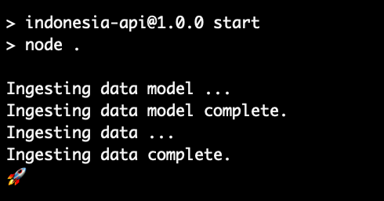

# Indonesia API

## AWS

For production you should use the Terraform script in `infra`

For development, you can either use Terraform or the alternative [manual steps](#manual-steps)

```bash
cd ./infra
aws-vault exec <ENVIROMENT_USER_NAME> -- terraform init
aws-vault exec <ENVIROMENT_USER_NAME> -- terraform apply
```

While this application is running it will listen for messages from AWS with Amazon SQS

Those messages are to notify this application of changes in Amazon S3

Wherever possible you should make changes in AWS _before starting this application_, or else _wait for the rocket_ before making changes in AWS



### Manual steps

- Step 1 - [Create an Access Key](docs/create-an-access-key.md)
- Step 2 - [Decide your Region](docs/decide-your-region.md)
- Step 3 - [Create a queue with Amazon SQS (Simple Queue Service)](docs/create-a-queue.md)
- Step 4 - [Create a bucket with Amazon S3](docs/create-a-bucket.md)
- Step 5 - [Edit the queue to assign an Access Policy](docs/edit-the-queue.md)
- Step 6 - [Edit the bucket to send events to the queue](docs/edit-the-bucket.md)
- Step 7 - [Review your `.env` file](docs/review-your-env.md)

Upload files into AWS _before starting this application_, or else _wait for the 🚀_!

## Configuration

A `.env.default` file in the project root contains the _required_ environment variables from which you can create a `.env` for development or production

The `.env.default` also indicates the many more _optional_ variables which can be set

For best results, and in particular, ensure that XSLX and CSV files in AWS are _named as expected_ by the application

You can always change the environment variables for the application to expect different file names, but starting from AWS is probably simpler!

### CSV - Data Model

The default directory for XLSX files is `.xlsx`

This is configurable with the environment variable `XLSX_DIRECTORY`

```dotenv
XLSX_DIRECTORY=<DIRECTORY PATH>
```

Or with the command line argument `--XLSX_DIRECTORY`

```bash
npm start -- --XLSX_DIRECTORY '<DIRECTORY PATH>'
```

The default file name for the Data Model is `Data Model.xlsx`

This is configurable with the environment variable `DATA_MODEL_FILE_NAME`

```dotenv
DATA_MODEL_FILE_NAME=<FILE NAME>
```

Or with the command line argument `--DATA_MODEL_FILE_NAME`

```bash
npm start -- --DATA_MODEL_FILE_NAME '<FILE NAME>'
```

### CSV - Data

The default directory for CSV files is `.source`

This is configurable with the environment variable `SOURCE_DIRECTORY`

```dotenv
SOURCE_DIRECTORY=<DIRECTORY PATH>
```

Or with the command line argument `--SOURCE_DIRECTORY`

```bash
npm start -- --SOURCE_DIRECTORY '<DIRECTORY PATH>'
```

The default file names for the Data are

- `Impact_Overall.csv`
- `WUR_citation.csv`
- `WUR_ID_mapping.csv`
- `WUR_metrics.csv`
- `WUR_portal.csv`
- `WUR_Ref_data.csv`

These are configurable with the environment variables

```dotenv
IMPACT_OVERALL_FILE_NAME=<FILE NAME>
WUR_PORTAL_FILE_NAME=<FILE NAME>
WUR_CITATIONS_FILE_NAME=<FILE NAME>
WUR_METRICS_FILE_NAME=<FILE NAME>
WUR_ID_MAPPING_FILE_NAME=<FILE NAME>
WUR_REF_DATA_FILE_NAME=<FILE NAME>
```

Or with the command line arguments

```bash
npm start -- \
  --IMPACT_OVERALL_FILE_NAME '<FILE NAME>' \
  --WUR_PORTAL_FILE_NAME '<FILE NAME>' \
  --WUR_CITATIONS_FILE_NAME '<FILE NAME>' \
  --WUR_METRICS_FILE_NAME '<FILE NAME>' \
  --WUR_ID_MAPPING_FILE_NAME '<FILE NAME>' \
  --WUR_REF_DATA_FILE_NAME '<FILE NAME>'
```

Note, in this project _command line arguments_ take precedence over _environment variables_

The default directory `.source` is excluded from Git

### JSON

The default directory for JSON files is `.target`

This is configurable with the environment variable `TARGET_DIRECTORY`

```dotenv
TARGET_DIRECTORY=<DIRECTORY PATH>
```

Or with the command line argument `--TARGET_DIRECTORY`

```bash
npm start -- --TARGET_DIRECTORY '<DIRECTORY PATH>'
```

Again, note in this project _command line arguments_ take precedence over _environment variables_

And the default directory `.target` is excluded from Git

### Basic Auth

This project implements Basic Auth with credentials supplied to it in JSON format either as an environment variable or from the command line

```dotenv
BASIC_AUTH_USERS={"<USERNAME>":"<PASSWORD>"}
```

Or

```bash
npm start -- --BASIC_AUTH_USERS '{"<USERNAME>":"<PASSWORD>"}'
```

## Serving the JSON

Start the server in a terminal

```bash
npm start
```

Wherever possible, upload files into AWS _before_ starting the application, or _wait for the rocket_ before making changes to files in AWS


You can request data from any of six routes

- `/impact-overall`
- `/wur-portal`
- `/wur-citations`
- `/wur-metrics`
- `/wur-id-mapping`
- `/wur-ref-data`

And each route accepts up to three query parameters (which may be combined)

- `institution_id`
- `year`
- `subject_id`

An `institution_id` is a string of the form `i-00000000` (where each `0` is an integer between `0` and `9` inclusive)

A `year` is a year (between 2001 and the current year inclusive)

A `subject_id` is a string

Response data is filtered based on the request query parameter values

#### `/impact-overall`

Accepts

- `institution_id`
- `year`

#### `/wur-portal`

Accepts

- `institution_id`
- `year`
- `subject_id`

#### `/wur-citations`

Accepts

- `institution_id`
- `year`
- `subject_id`

#### `/wur-metrics`

Accepts

- `institution_id`
- `year`
- `subject_id`

#### `/wur-id-mapping`

Accepts

- `institution_id`

#### `/wur-ref-data`

Accepts

- `institution_id`

### `curl`

Use `curl` in another terminal to request data

Assuming the server is running on port `80` with Basic Auth credentials `{"username":"password"}`

```bash
curl http://localhost/wur-portal \
  -u username:password
```

```bash
curl http://localhost/wur-citations \
  -u username:password
```

```bash
curl http://localhost/wur-metrics \
  -u username:password
```

And using the route `/wur-portal` with query parameters

```bash
curl http://localhost/wur-portal?institution_id=i-33670869 \
  -u username:password
```

```bash
curl http://localhost/wur-portal?year=2020 \
  -u username:password
```

```bash
curl http://localhost/wur-portal?subject_id=law \
  -u username:password
```

Or, combined

```bash
curl http://localhost/wur-portal?institution_id=i-33670869&year=2020&subject_id=law \
  -u username:password
```

## Swagger

The Swagger configuration is generated automatically from the Data Model at application start

Assuming the server is running on port `80` with Basic Auth credentials `{"username":"password"}` Swagger JSON is available at the location

```
http://localhost/api-docs/swagger.json
```

Swagger UI is available at the location

```
http://localhost/api-docs
```

## Docker

### Building the Docker image

```bash
docker build -t indonesia-api .
```

### Starting the Docker container

```bash
docker compose up -d
```

The container exposes the application on port `3001` of the host environment

Assuming Basic Auth credentials `{"username":"password"}`

```bash
curl http://localhost:3001/wur-portal \
  -u username:password
```

## Debugging

All files ingested into the application at application start are contained in either `XLSX_DIRECTORY` (for the Data Model) or `SOURCE_DIRECTORY` (for the Data)

There is a two-step _transformation_ process which takes the CSV source files and generates the JSON target files in `TARGET_DIRECTORY`

- In the first step, a _sibling_ JSON file is written beside each CSV in `SOURCE_DIRECTORY`
- In the second step, the sibling is transformed again to another JSON file which is written to `TARGET_DIRECTORY`

Each endpoint serves the JSON from `TARGET_DIRECTORY` so in the event that an endpoint is returning a `404` response:

- Confirm that the appropriate CSV file exists in `SOURCE_DIRECTORY` and it has the expected structure and content
- Confirm that the _sibling_ JSON file has been created in the same directory
- Confirm that the appropriate JSON file exists in `TARGET_DIRECTORY` and that it is valid

You can use a JSON validator to validate the content of the JSON files in `TARGET_DIRECTORY`. Invalid JSON means a read/write fault during ingestion which can be corrected by restarting the application. Otherwise, the _most likely_ cause of an error (particularly where there is no other logging) is a file name mismatch, or _typo_, at AWS

An endpoint is _expected_ to return a `404` response when there is no data _on the file system_

Otherwise, "no data" is indicated by a JSON array `[]`

Errors should log with a 💥
