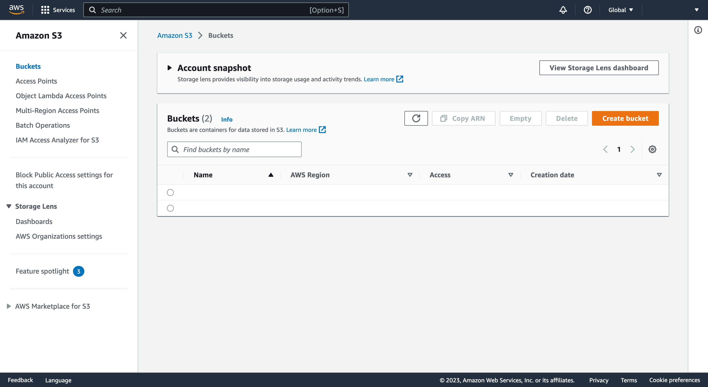
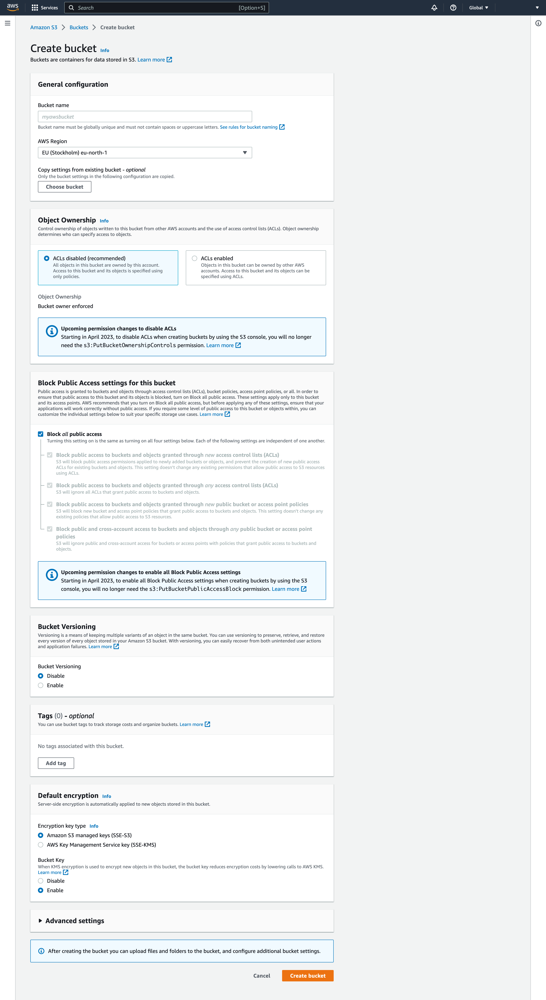
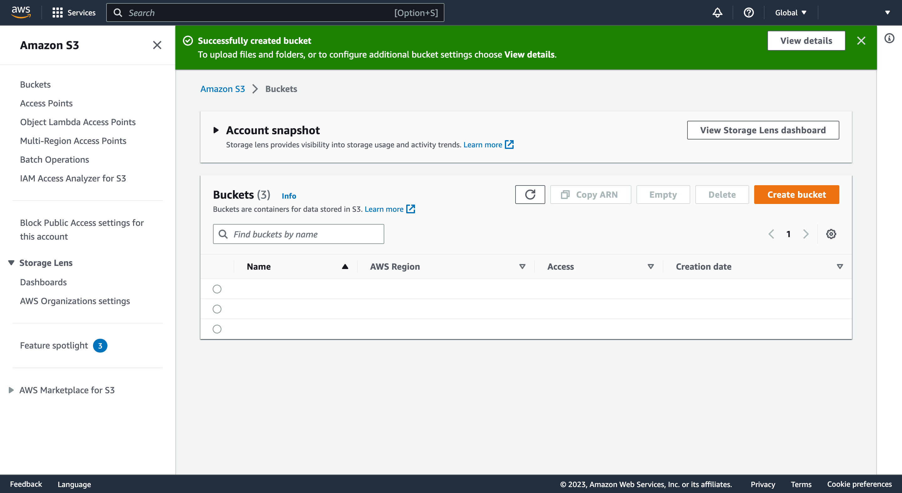
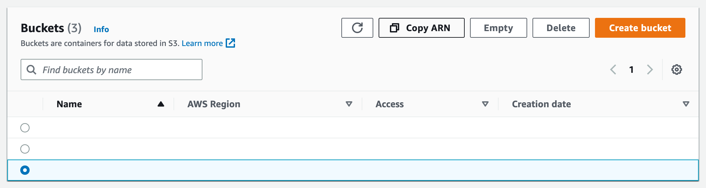

# 4 - Create a bucket with Amazon S3

[Go to the Amazon S3 Console](https://console.aws.amazon.com/s3/)

It should default to the _Buckets_ page but if not you can click "Buckets" in the navigation on the left-hand side of the page to see the list of buckets in a table



Click "Create bucket" on the right above the table to create a bucket

## Creating a bucket

Enter a bucket name in the "Bucket name" field of the General configuration panel at the top of the page

The "AWS Region" may default to somewhere which is not your preferred region. You should change it to be your `<AWS REGION>`

Accept the default values in the remaining panels and click "Create bucket" at the bottom right of the page to proceed to the next step



A green banner at the top of the page confirms your bucket has been created

Confirm that the "Name" column in the table has a row with the bucket name you entered at the previous step

The bucket name be used in the environment variable `AWS_BUCKET_NAME` which you should ensure is defined in your host's `.env` file. Elsewhere, I will refer to the bucket name as `<AWS BUCKET NAME>`. Put it into your `.env` file now!

```dotenv
AWS_BUCKET_NAME=<AWS BUCKET NAME>
```



Click the radio input at the left-hand side of the table row for your bucket to select the bucket

Elsewhere, I will refer to the bucket ARN as `<AWS BUCKET ARN>`. Click "Copy ARN" to copy it to your device's clipboard, then paste it into another file for later reference



Proceed to Step 5 - [Edit the queue to assign an Access Policy](edit-the-queue.md)
