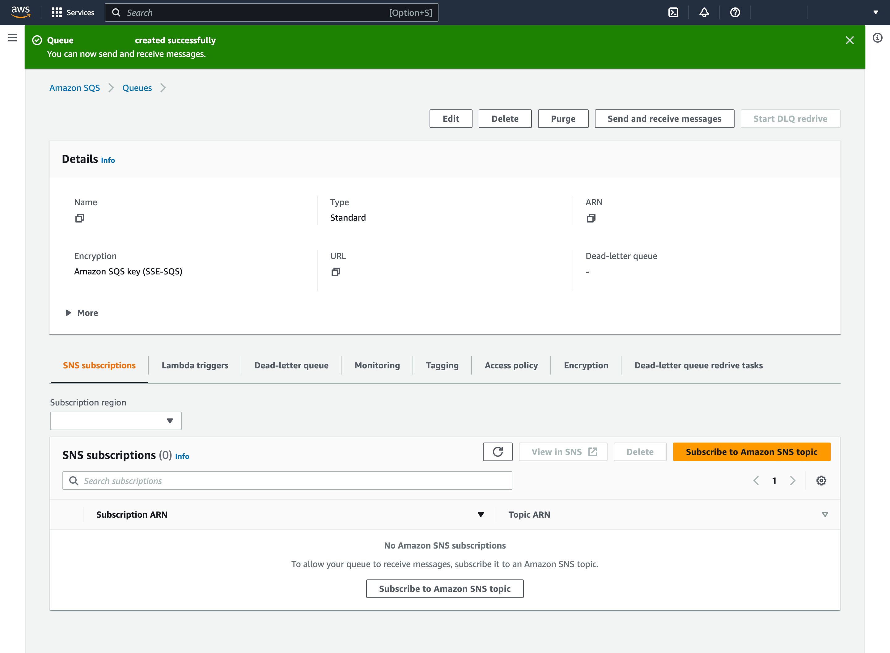

# 3 - Create a queue with Amazon SQS

[Go to the Amazon SQS page](https://console.aws.amazon.com/sqs/v2) to see the list of queues in a table

The list is specific to the _Region_ you have currently selected so make sure you have selected the _Region_ you want before proceeding. [You can find your Region or change it from the flyout menu at the second-from-top right corner of every page](deciding-your-region.md)


Click "Create queue" on the right above the table to create a queue

## Creating a queue

Enter a queue name in the "Name" field of the Details panel at the top of the page

Accept the default values in the remaining panels and click "Create queue" at the bottom right of the page to proceed to the next step


A green banner at the top of the page confirms your queue has been created

Take note of the values in the Details panel at the top of the page



- Confirm that the "Name" is the queue name you entered at the previous step

Elsewhere, I will refer to the queue name as `<AWS QUEUE NAME>`. Click the icon to copy it to your device's clipboard, then paste it into another file for later reference

- Note the "URL"

The value will be used in the environment variable `AWS_QUEUE_URL` which you should ensure is defined in your host's `.env` file. Click the icon to copy it to your device's clipboard, then put it into your `.env` file now!

```dotenv
AWS_QUEUE_URL=<AWS QUEUE URL>
```

- Note the "ARN"

Elsewhere, I will refer to the queue ARN as the `<AWS QUEUE ARN>`. Click the icon topy it to your device's clipboard, then paste it into another file for later reference

Proceed to Step 4 - [Create a bucket with Amazon S3](create-a-bucket.md)
