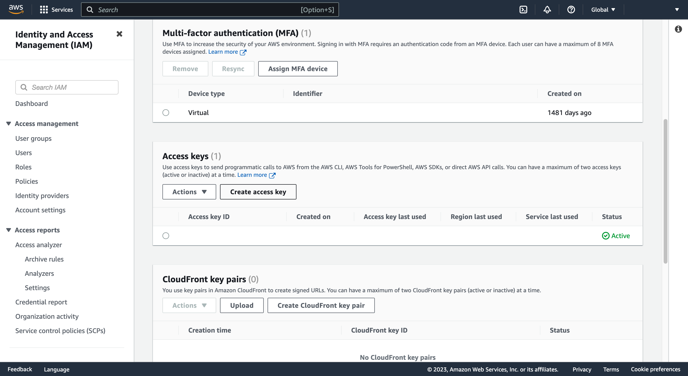

# 1 - Create an Access Key

[Go to the AWS Management Console](https://console.aws.amazon.com)

Select "Security credentials" from the flyout menu at the top right corner of any page to open the "My security credentials" page. "Security credentials" is the last-but-one item in the menu


Scroll down to find the Access Keys table and click "Create access key". (There is a limit of two access keys at a time, so you may need to delete an access key to create another, or reuse one you already have)



Click through to the "Retrieve access key" page. A green banner at the top of the page confirms your access key has been created


You should copy each of the "Access key" and "Secret access key" values to your device's clipboard for use in the environment variables `AWS_ACCESS_KEY_ID` and `AWS_SECRET_ACCESS_KEY` respectively which you should ensure are defined in your host's `.env` file

Put them there now!

```dotenv
AWS_ACCESS_KEY_ID=<AWS ACCESS KEY>
AWS_SECRET_ACCESS_KEY=<AWS_SECRET_ACCESS_KEY>
```

Proceed to Step 2 - [Decide your Region](decide-your-region.md)
