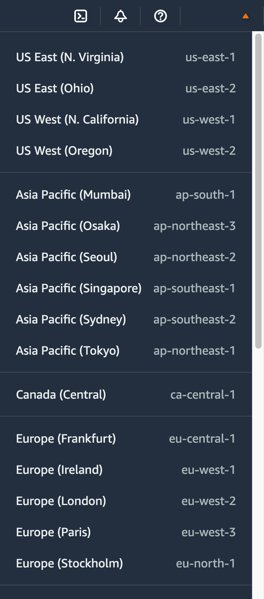

# 2 - Decide your Region

[Go to the AWS Management Console](https://console.aws.amazon.com)

You can find your currently selected _Region_ from the flyout menu at the second-from-top right corner of every page



You can change your _Region_ from this menu. You should choose a _Region_ which is _nearest_ to your host's physical location

That may be different in development and production. Assuming you are a developer in London, choose `eu-west-2`

Elsewhere, I shall refer to it as `<AWS REGION>`. The value will be used in the environment variable `AWS_REGION` which you should ensure is defined in your host's `.env` file. Put it there now!

```dotenv
AWS_REGION=<AWS REGION>
```

Proceed to Step 3 - [Create a queue with Amazon SQS (Simple Queue Service)](create-a-queue.md)
