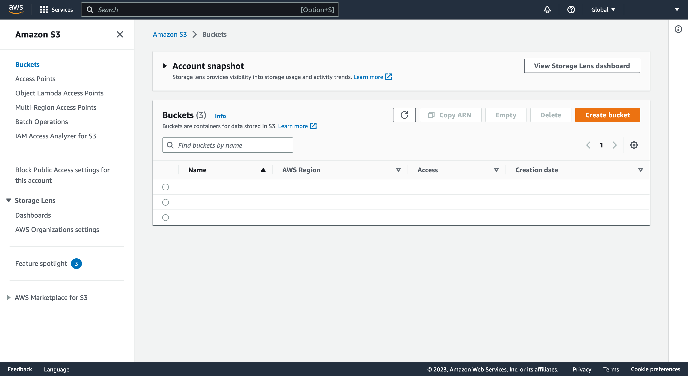
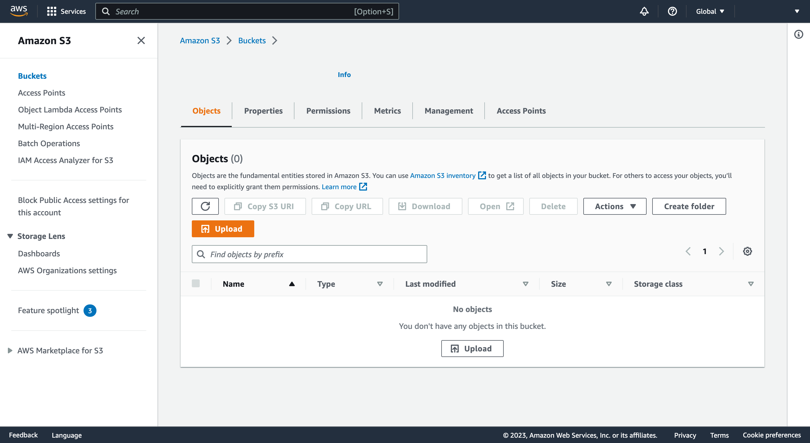
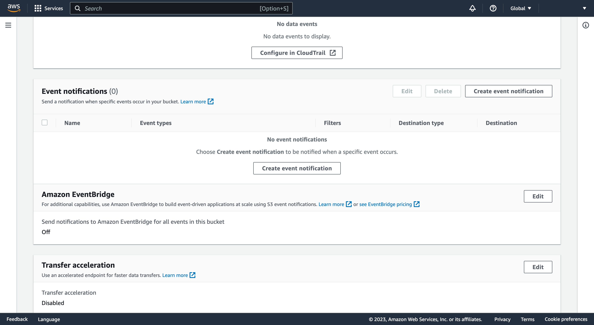
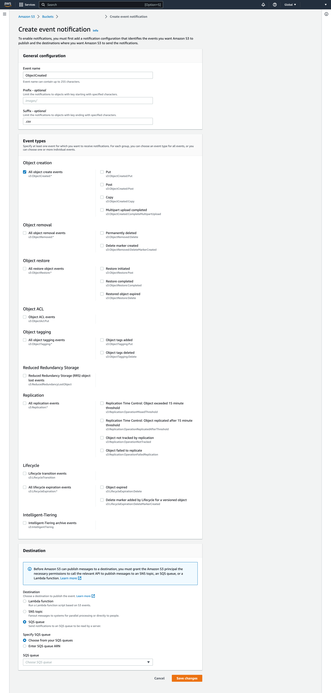
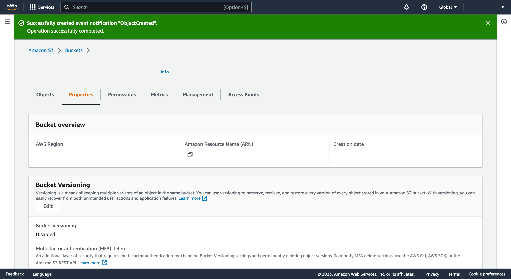
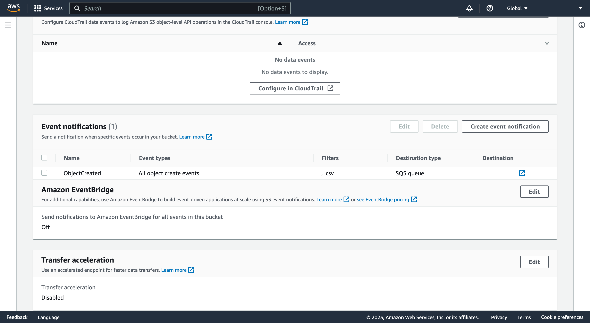
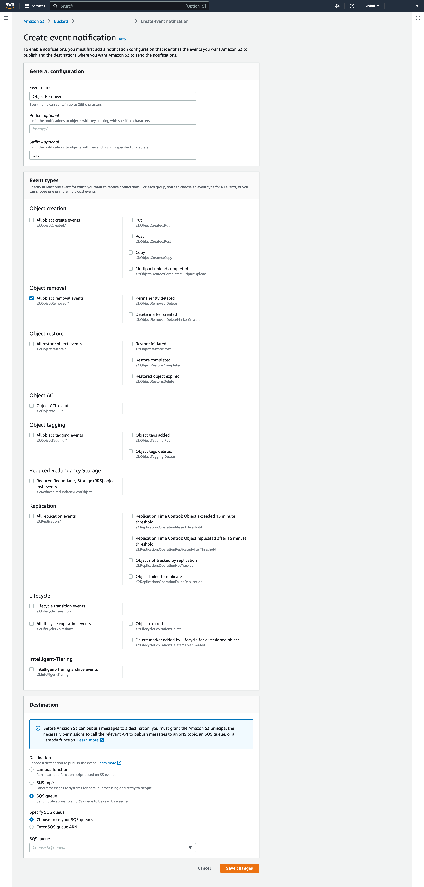
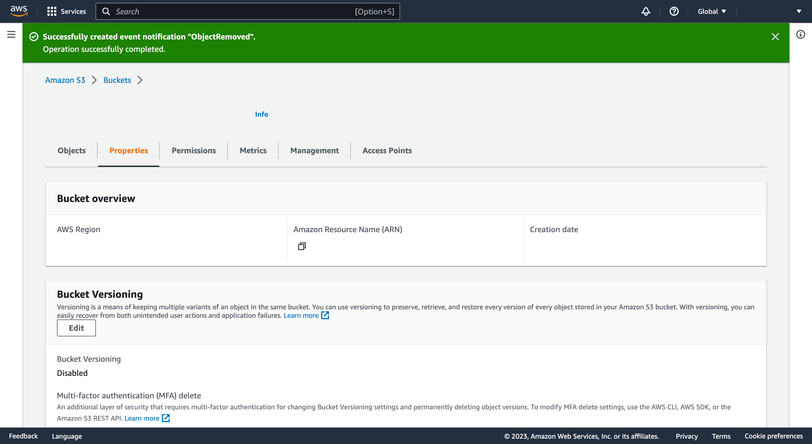
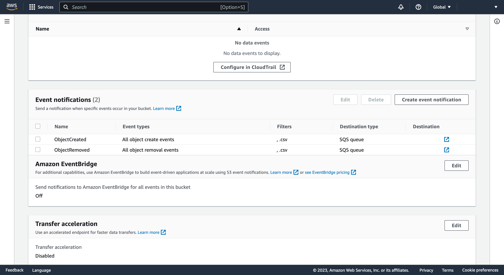

# 6 - Edit the bucket to send events to the queue

[Go to the Amazon S3 Console](https://console.aws.amazon.com/s3/)

It should default to the _Buckets_ page but if not you can click "Buckets" in the navigation on the left-hand side of the page to see the list of buckets in a table

Click the bucket name in the "Name" column at the left-hand side of the table row for your bucket to go to the next step

It should default to the "Objects" tab

Click the "Properties" tab to select it and scroll down until the "Event notifications" panel is visible

## Create event notification "ObjectCreated"

With the "Event notifications" panel visible, click "Create event notification" on the right above the table to create an event notification

In the General configuration panel _at the top of the page_

- Enter "ObjectCreated" in the "Event name" field
- Enter ".csv" in the "Suffix - optional" field

In the Event types panel _below the General configuration panel_

- Click to select the checkbox input "All object create events"

_Scroll to the bottom of the page_ for the Destination panel

- Under the title "Destination" click to select the radio input "SQS queue"

This reveals a set of options under the title "Specify SQS queue"

- Click to select the radio input "Choose from your SQS queues"

Under the title "SQS queue" select your queue name from the dropdown input

Click "Save changes" at the bottom of the page

A green banner at the top of the page confirms your event notification has been created

Ensure the "Properties" tab is selected and scroll down until the "Event notifications" panel is visible

Confirm that the event notifications table has a row with the event notification you described at the previous step

## Create event notification "ObjectRemoved"

With the "Event notifications" panel visible, click "Create event notification" on the right above the table to create another event notification

In the General configuration panel _at the top of the page_

- Enter "ObjectRemoved" in the "Event name" field
- Enter ".csv" in the "Suffix - optional" field

In the Event types panel _below the General configuration panel_

- Click to select the checkbox input "All object removal events"

_Scroll to the bottom of the page_ for the Destination panel

- Under the title "Destination" click to select the radio input "SQS queue"

This reveals a set of options under the title "Specify SQS queue"

- Click to select the radio input "Choose from your SQS queues"

Under the title "SQS queue" select your queue name from the dropdown input

Click "Save changes" at the bottom of the page

A green banner at the top of the page confirms your event notification has been created

Ensure the "Properties" tab is selected and scroll down until the "Event notifications" panel is visible

Confirm that the event notifications table has a row with the event notification you described at the previous step

Proceed to Step 7 - [Review your `.env` file](review-your-env.md)
