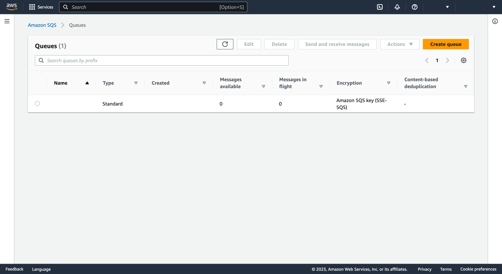
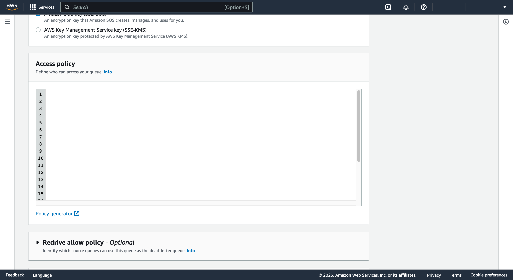

# 5 - Edit the queue to assign an Access Policy

[Go to the Amazon SQS page](https://console.aws.amazon.com/sqs/v2) to see the list of queues in a table

Click on the queue name in the table to go to the queue details page to see the Details panel toward the top of the page



Copy to your device's clipboard the queue name and the queue ARN


Below the Details panel is a list of tab headings. Scroll down so that the tab content is visible and click "Access Policy"

Click "Edit" on the right-hand side of "Access policy (Permissions)" field to go to the queue edit page


Scroll down _again_ to see the "Access Policy" panel



You should by now have set aside the following values

- `<AWS ACCOUNT ID>`
- `<AWS REGION>`
- `<AWS QUEUE NAME>`
- `<AWS QUEUE ARN>`
- `<AWS BUCKET ARN>`

Amend the following JSON with those values as indicated

```json
{
  "Version": "2012-10-17",
  "Id": "<AWS QUEUE NAME>-access-policy",
  "Statement": [
    {
      "Sid": "<AWS QUEUE NAME>-statement",
      "Effect": "Allow",
      "Principal": {
        "Service": "s3.amazonaws.com"
      },
      "Action": "SQS:SendMessage",
      "Resource": "<AWS QUEUE ARN>",
      "Condition": {
        "StringEquals": {
          "aws:SourceAccount": "<AWS ACCOUNT ID>"
        },
        "ArnLike": {
          "aws:SourceArn": "<AWS BUCKET ARN>"
        }
      }
    }
  ]
}
```

Copy the JSON to your device's clipboard and paste it into the "Access policy" panel field (overwriting anything already there)

Click "Save" at the bottom of the page

A green banner at the top of the page confirms your queue has been edited


Proceed to Step 6 - [Edit the bucket to send events to the queue](edit-the-bucket.md)
